# Ease Of Mind

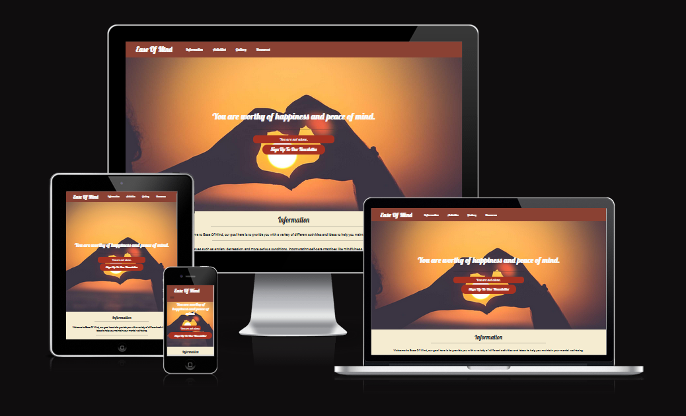
 

## Overview

### Purpose

### Ease Of Mind
Is a Mental Health Awareness and Wellbeing webpage. With a focus on providing clarity, information and suggestions on how to manage and maintain your mental health. This webpage aims to provide useful information, links, resources and potential activities for its users.

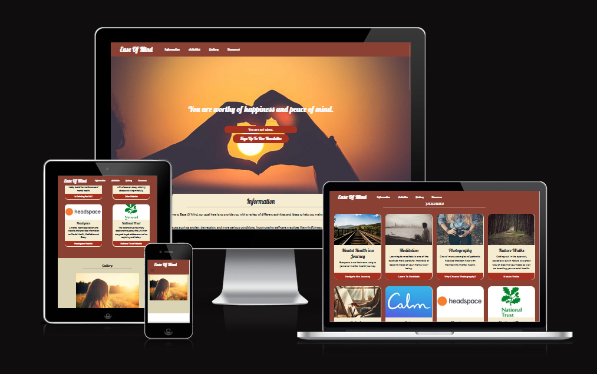

### Target Audience

### Who is it for?
Ease Of Mind is for any individual who feels their mental health is suffering or has concerns about related issues. No particular age group is targeted or demographic as the website is intended for all to benefit from. The aim of Ease Of Mind is to point people in the right direction depending on there needs, however the focus of the page is more orientated towards providing activities and information for people to help maintain their mental well-being.

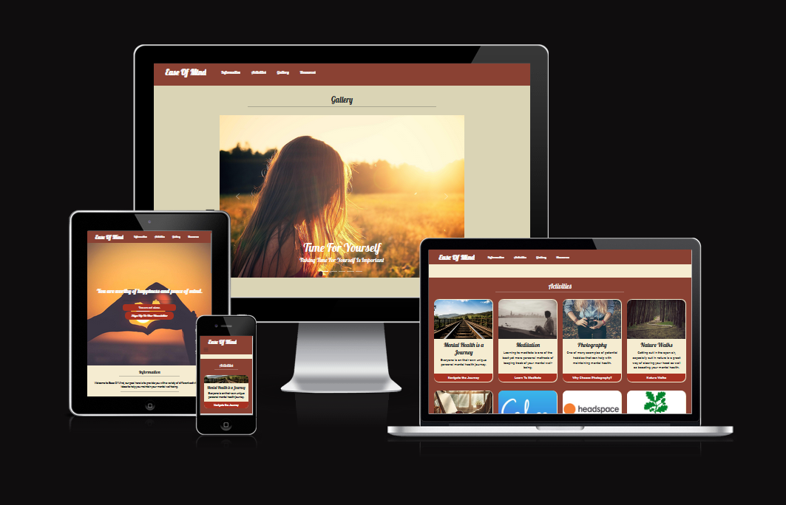

## User Stories

### Must-Have User Stories
- **User Story 1:** As a user, I must be able to access clear information about mental health topics. 
  **Acceptance Criteria:** Provide relevant content, ensure formatting is clear and concise.
  [User Story #1](https://github.com/NSJ021/Ease-Of-Mind-Website-CI-Project/issues/1)

- **User Story 2:** As a user, I require the ability to quickly navigate the site to a desired section.  
  **Acceptance Criteria:** Provide quick, easy to use access to all areas of the website (Navigation Bar, links to website sections)
  [User Story #2](https://github.com/NSJ021/Ease-Of-Mind-Website-CI-Project/issues/2)

- **User Story 3:** As the site owner, I require a welcoming webpage that displays mental health information in a clear manner.  
  **Acceptance Criteria:** Ensure information is on topic, relevant and displayed clearly, whilst taking considerations in design to make sure the website is welcoming, focusing on colour schemes and layout.
  [User story #3](https://github.com/NSJ021/Ease-Of-Mind-Website-CI-Project/issues/3)

### Should-Have User Stories
- **User Story 4:** As as user, I would like to sign up to a monthly newsletter. 
  **Acceptance Criteria:** Include a form on the website to enable the user to submit their information.
  [User Story #4](https://github.com/NSJ021/Ease-Of-Mind-Website-CI-Project/issues/4)

### Could-Have User Stories
- **User Story 5:** As a user, I would enjoy interactive content.  
  **Acceptance Criteria:** Utilise Javascript and other media methods to enhance user interactions.
  [User Story #5](https://github.com/NSJ021/Ease-Of-Mind-Website-CI-Project/issues/5)

### Github Issues and Project

For this project I decided to use the Github issues and projects section as a form of adapting Agile principles into the project.
The project board contains all To-do, In progress and Completed User stories, the user stories themselves are GitHub issues. The options on Github are not exactly Agile authentic but they serve a similar purpose in regard to organisation and keeping track of progress.

 

 

 

## Design Decisions

### Wireframes

Below shows the design and thought process for the different screen-sizes which need to be considered. Mobile, Tablet and Desktop, with a focus on mobile first then adapting to larger screen sizes. The wire-frames show and highlight key features and how screen-size impacts them.

 

 

 

### HTML & CSS Layout

For the creation of both index.html and style.css, the HTML was structured using some semantic elements such as header, section and footer. Comments were used to symbolise the beginning and end of each key section.

Style.css was formatted to match the layout of index.html in terms of structure. All variables and general styles are towards the top of the file, followed by a commented section for each main section of the HTML.

### Accessibility Considerations
With regard to accessibility a variety of topics need to be considered, some of these are colour contrast, having alt text for images and readable fonts.

### Colour Scheme and Font Choices

Chosen Colour Scheme, to provide a warm, gentle and cosy tone

 

#### Fonts
Chosen Fonts to be used throughout the project
[Lobster](https://fonts.google.com/specimen/Lobster), [Roboto](https://fonts.google.com/specimen/Roboto)
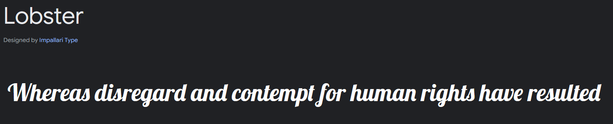

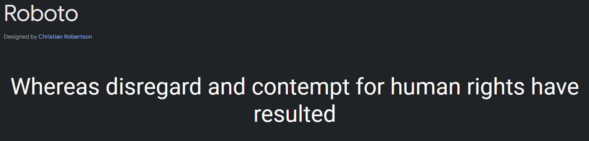

#### Colour Contrast Considerations

[WCAG Color Contrast Checker](https://accessibleweb.com/color-contrast-checker/)

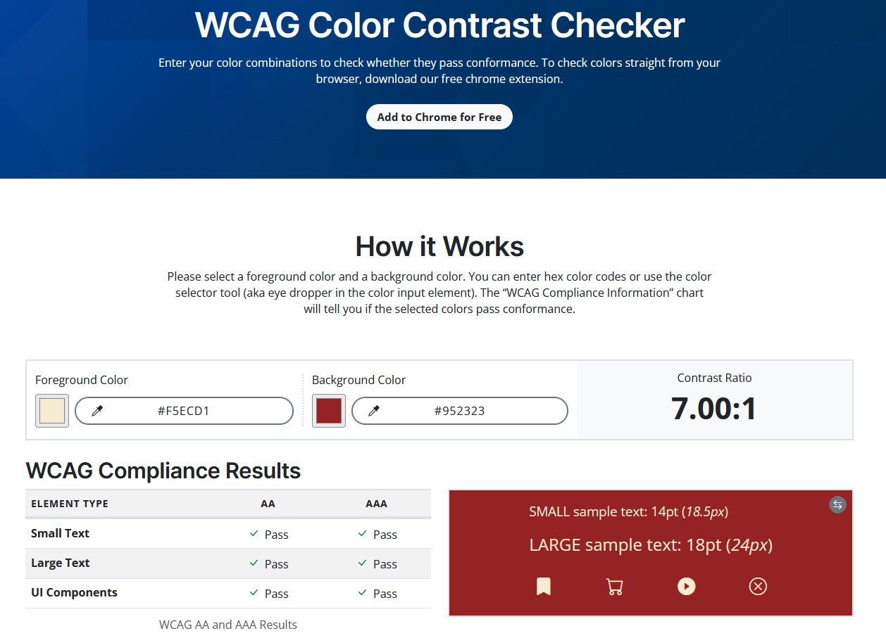

## Features Implementation

### Core Features (Must-Haves)
- **Feature 1:** Hero Section with a welcoming background image.

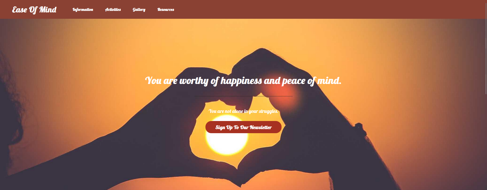

 

- **Feature 2:** Information cards, containing relevant and concise information.

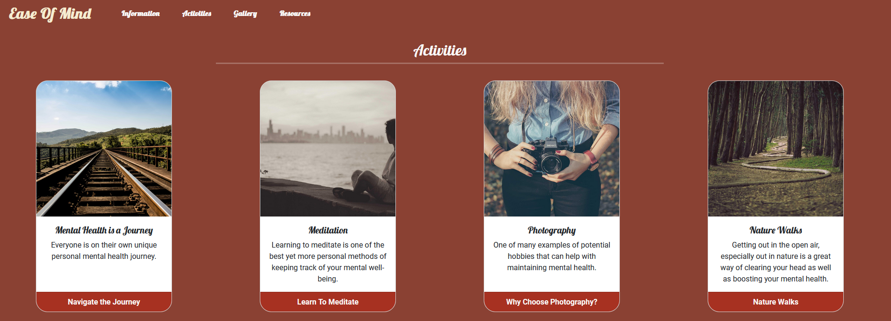

 

- **Feature 3:** Consistent navigation on the site, allowing users to jump to different sections of the website.

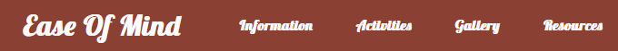

### Advanced Features (Should-Haves)
- **Feature 1:** Ensure there is a well formatted form on the website to enable users the ability to enter their details, such as name and email address. Including this feature will enhanced user engagement and usability, it would also benefit the site owner as they not only get subscribers to their newsletter but also can use these metrics to gauge interest.

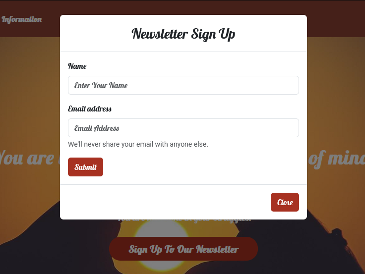

### Optional Features (Could-Haves)
- **Feature 1:** Enhancing user interaction, this could be done via additional media types e.g. videos. Or perhaps the use of Javascript to create more interactions on the website in general.

A Gallery section was added to give the user more content to look through. Also with the focus on interactions some subtle animations have been added to cards and buttons this does not complete this feature but is a good starting point.

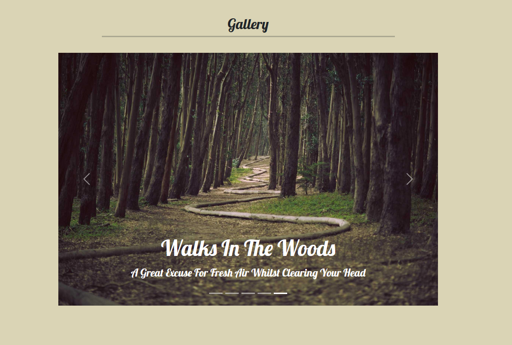

### Content and Image References
Images were primarily take from [Lorum Picsum](https://picsum.photos/)
 
Content topics and suggestions were obtained via personal research and ChatGPT.
 
Logo Images from various apps were used, they were taken from the appropriate apps homepage. E.g Calm.com, Headspace.com, National Trust.com

#### ChatGPT
ChatGPT was used minimally, for content generation ideas. Such as what topics to mention, possible activities to promote mental health and example images.

## Testing and Validation

### Testing Results
Various testing has taken place throughout the project. Firstly checking screen responsive across mobile and tablet was an ongoing testing process. Generally all elements display well. Some elements required tweaking here and there with margins and padding to ensure items were as visible as possible on all screen-sizes and orientations. Testing was also performed with Dev tools, they were primarily used to troubleshoot and resolve minor inconsistencies.

#### Bugs and Fixes
One minor bug but now fixed was how the hero section background image was shrinking and sliding in an undesired manor as the scene got smaller. This was fixed by tweaking the background image in the CSS file, background: url("../images/heart-hands.jpg") no-repeat center; the no-repeat center was added.

Another minor bug was that the Navigation bar was not expanding into the burger icon at the correct screen size. Initial set with the bootstrap class of navbar-expand-sm, this was changed to md instead thus creating a more responsive navbar.

### Validation

Both index.html and style.css have been ran through the appropriate validators:
 
[HTML Validator](https://validator.w3.org/)
 
[CSS Validator](https://jigsaw.w3.org/css-validator/)

There we some minor issues, primarily forgetting alt text attributes on some images and some miss placed forward slash /. All have been resolved.

#### Initial HTML Validation

#### CSS Validation

#### CSS Warnings
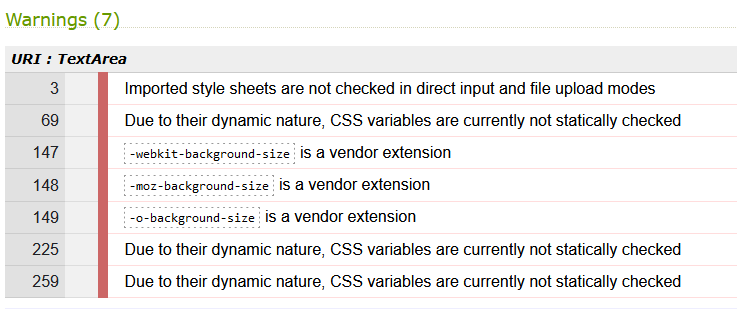

With regard to the CSS variables, the list below is all variables used in style.css, these were done to enable easier management of the colour scheme.

    --off-white: #fafafa;
    --cream: #F5ECD1;
    --beige: #DAD4B5;
    --medium-red: #A73121;
    --rich-red: #8A4133;
    --Warm-red: #952323;

## Deployment

### Deployment Process
The deployment process used for this project is via Github and Github pages, Github pages allows the hosting of a simple front end web applications. The process is fairly simple as github pages simply pulls the required information from the respective repo.

### Git, Github and Github Pages

Git, Github and Github Pages are used in this project for all hosting, version control and storage of the project.

The project is deployed via Github Pages, the process is detailed below.

## Reflection on Development Process

### Successes
With various trial and error, the creation of a warm, welcoming website was achieved. Although basic in functionality getting the scrollable background hero image was a good achievement and a great feature of the webpage. Using the bootstrap cards was another great addition and success for achieving the desired feel for the webpage.

### Challenges

From learning CSS and transitioning to BootStrap, some elements were made easy but then others were made more difficult due to having to learn new documentation, classes and methods of work.

### Final Thoughts
Overall the project was a good success, all must and should have features and user stories were completed to a MVP state, there is always room for improvement and optimisation. Such could have user stories and features would ned to be added during the next iteration of the project.

## Code Attribution

Code Institute - Snippets and Inspirations from Love Running, Whiskey Drop and Love Rosie Projects.
 
[Josh Comeau - CSS Transitions](https://www.joshwcomeau.com/animation/css-transitions/) - Code snippets taken to create the bounce class and animation in style.css

## Future Improvements

Future improvements would to increase the interactions for the user, perhaps more videos /  other media content. Quizzes Etc. However I did decide to add a gallery section which only enhanced the websites content further and provided some more visual content.
