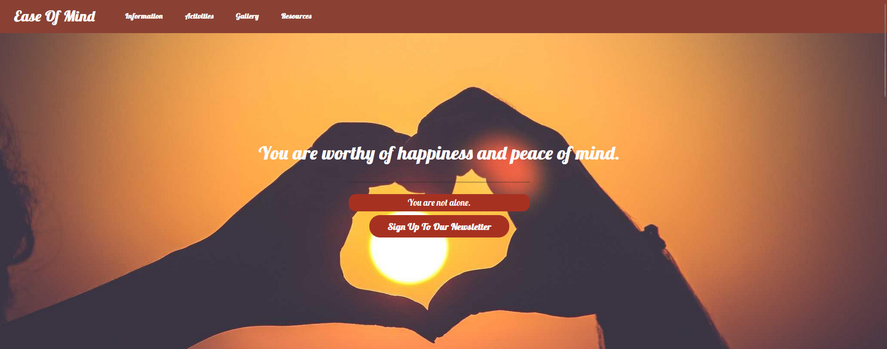

# Ease Of Mind

## Overview

### Purpose

### Ease Of Mind
Is a Mental Health Awareness and Wellbeing webpage. With a focus on providing clarity, information and suggestions on how to manage and maintain your mental health. This webpage aims to provide useful information, links, resources and potential activities for its users.

### Target Audience

### Who is it for?
Ease Of Mind is for any individual who feels their mental health is suffering or has concerns about related issues. No particular age group is targeted or demographic as the website is intended for all to benefit from.

## User Stories

### Must-Have User Stories
- **User Story 1:** As a user, I must be able to access clear information about mental health topics. 
  **Acceptance Criteria:** Provide relevant content, ensure formatting is clear and concise.
  [User Story #1](https://github.com/NSJ021/Ease-Of-Mind-Website-CI-Project/issues/1)

- **User Story 2:** As a user, I require the ability to quickly navigate the site to a desired section.  
  **Acceptance Criteria:** Provide quick, easy to use access to all areas of the website (Navigation Bar, links to website sections)
  [User Story #2](https://github.com/NSJ021/Ease-Of-Mind-Website-CI-Project/issues/2)

- **User Story 3:** As the site owner, I require a welcoming webpage that displays mental health information in a clear manner.  
  **Acceptance Criteria:** Ensure information is on topic, relevant and displayed clearly, whilst taking considerations in design to make sure the website is welcoming, focusing on colour schemes and layout.
  [User story #3](https://github.com/NSJ021/Ease-Of-Mind-Website-CI-Project/issues/3)

### Should-Have User Stories
- **User Story 1:** As as user, I would like to sign up to a monthly newsletter. 
  **Acceptance Criteria:** Include a form on the website to enable the user to submit their information.
  [User Story #4](https://github.com/NSJ021/Ease-Of-Mind-Website-CI-Project/issues/4)

### Could-Have User Stories
- **User Story 1:** As a user, I would enjoy interactive content.  
  **Acceptance Criteria:** Utilise Javascript and other media methods to enhance user interactions.
  [User Story #5](https://github.com/NSJ021/Ease-Of-Mind-Website-CI-Project/issues/5)

### Github Issues and Project

 

 

 

## Design Decisions

### Wireframes

 

 

 

### Accessibility Considerations
With regard to accessibilty a variety of topics need to be considered, some of these are colour contrast, having alt text for images and readable fonts.

### Colour Scheme and Font Choices

Chosen Colour Scheme, to provide a warm, gentle and cosy tone

 

#### Fonts
Chosen Fonts to be used throughout the project
 
[Lobster](https://fonts.google.com/specimen/Lobster)
 
[Roboto](https://fonts.google.com/specimen/Roboto)

#### Colour Contrast Considerations

[WCAG Color Contrast Checker](https://accessibleweb.com/color-contrast-checker/)

## Features Implementation

### Core Features (Must-Haves)
- **Feature 1:** Hero Section with a welcoming background image.

- **Feature 2:** Information cards, containing relevant and concise information.

- **Feature 3:** Consistent navigation on the site, allowing users to jump to different sections of the website.

### Advanced Features (Should-Haves)
- **Feature 1:** Ensure there is a well formatted form on the website to enabled users the ability to enter their details, such as name and email address. Including this feature enhanced user engagement and usability, it would also benefit the site owner as they not only get subscribers to their newsletter but also can use these metrics to gauge interest.

### Optional Features (Could-Haves)
- **Feature 1:** Enhancing user interaction, this could be done via additional media types e.g. videos. Or perhaps the use of Javascript to create more interactions on the website in general.

### Content and Image References
Images were primarily take from [Lorum Picsum](https://picsum.photos/)
 
Content topics and suggestions were obtained via personal research and ChatGPT.
 
Logo Images from various apps were used, they were taken from the appropriate apps homepage. E.g Calm.com, Headspace.com, National Trust.com

#### ChatGPT
ChatGPT was used minimally, for content generation ideas. Such as what topics to mention, possible activities to promote mental health and example images.

## Testing and Validation

### Testing Results
Summarize the results of testing across different devices and screen sizes.  
Mention any issues found and how they were resolved.  
**Guidance:** Summarize the results of your testing across various devices using tools like Chrome DevTools, as outlined in Phase 2. Mention any issues found and how they were resolved.

#### Bugs and Fixes
One minor bug but now fixed was how the hero section background image was shrinking and sliding in an undesired manor as the scene got smaller. This was fixed by tweaking the background image in the CSS file, background: url("../images/heart-hands.jpg") no-repeat center; the no-repeat center was added.

Navigation bar was not expanding into the burger icon at the correct screen size. Initial set with the bootstrap class of navbar-expand-sm, this was changed to md instead thus creating a more responsive navbar.

### Validation
Discuss the validation process for HTML and CSS using W3C and Jigsaw validators.  
Include the results of the validation process.  
**Guidance:** Document your use of W3C and Jigsaw validators to ensure your HTML and CSS meet web standards. Include any errors or warnings encountered and how they were resolved.

#### Initial HTML Validation

#### CSS Validation

## Deployment

### Deployment Process
The deployment process used for this project is via Github and Github pages, Github pages allows the hosting of a simple front end web applications. The process is fairly simple as github pages simply pulls the required information from the respective repo.

### Git, Github and Github Pages

Git, Github and Github Pages are used in thie project for all hosting, version control and storage of the project.

The project is deployed via Github Pages, the process is detailed below.

## Reflection on Development Process

### Successes
With various trial and error, the creation of a warm, welcoming website was achieved. Although basic in functionality getting the scrollable background hero image was a good achievement and a great feature of the webpage.

### Challenges

From learning CSS and transitioning to BootStrap, some elements were made easy but then others were made more difficult due to having to learn new documentation, classes and methods of work.

### Final Thoughts
Provide any additional insights gained during the project and thoughts on the overall process.  
**Guidance:** Begin drafting reflections during Phase 1 and update throughout the project. Finalize this section after Phase 4. Highlight successes and challenges, particularly regarding the use of AI tools, and provide overall insights into the project.

## Code Attribution
Properly attribute any external code sources used in the project (excluding GitHub Copilot-generated code).  
**Guidance:** Document any external code sources used throughout the entire project, especially during Phase 2 and Phase 3. Exclude GitHub Copilot-generated code from attribution.

Code Institute - Snippets and Inspirations from Love Running,, Whiskey Drop and Love Rosie Projects

## Future Improvements
Briefly discuss potential future improvements or features that could be added to the project.  
**Guidance:** Reflect on potential enhancements that could be made to the project after Phase 4: Final Testing, Debugging & Deployment. These could be Could user story features you didn’t have time to implement or improvements based on testing feedback.

Future improvements would to increase the interactions for the user, perhaps more videos /  other media content. Quizzes Etc.
